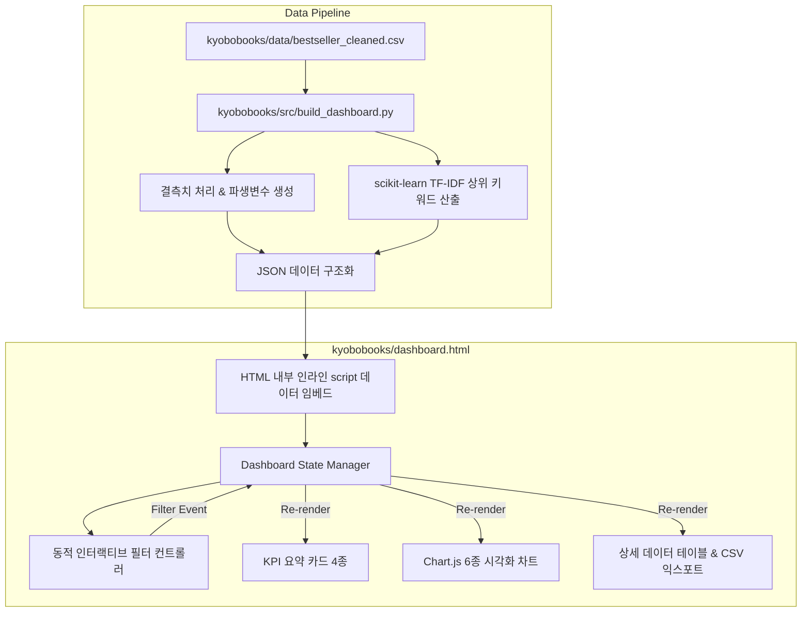

# 🚀 [구현 계획서] 교보문고 IT 베스트셀러 Chart.js 웹앱 대시보드 구축

**문서 버전**: v2.0 (초정밀 구현 명세)  
**대상 리포지토리**: [Icehodduk/cli-practice](https://github.com/Icehodduk/cli-practice)  
**관련 GitHub 이슈**: [#1](https://github.com/Icehodduk/cli-practice/issues/1)  
**산출물 파일**: `kyobobooks/dashboard.html`, `kyobobooks/src/build_dashboard.py`

---

## 1. 프로젝트 목표 및 개요 (Goal Description)

본 프로젝트는 교보문고 IT/컴퓨터 베스트셀러 정제 데이터(`kyobobooks/data/bestseller_cleaned.csv`, 479권)를 기반으로, 외부 백엔드 서버 없이 브라우저에서 즉시 구동되는 **단일 독립 실행형(Standalone) 웹 애플리케이션 대시보드**(`kyobobooks/dashboard.html`)를 구축하는 것입니다.

사용자가 실시간으로 도서명/저자를 검색하고 출판사, 연도, 가격대 조건을 필터링하면 상단 KPI 지표와 **Chart.js 기반 6종의 인터랙티브 차트**, 그리고 하단의 상세 데이터 테이블이 즉시 반응형으로 리렌더링되는 프로덕션 수준의 미니멀 화이트 비즈니스 대시보드를 제공합니다.



---

## 2. 인터뷰 기반 핵심 설계 결정 사항 (User Review Required)

> [!IMPORTANT]
> 1. **서빙 방식**: 별도의 Node.js나 Python 웹 서버를 띄울 필요 없이, 로컬 파일 탐색기에서 `dashboard.html`을 더블 클릭(`file://`)하여 즉시 사용할 수 있는 **완전 독립 실행형(Standalone) Single HTML** 구조.
> 2. **CORS 회피 전략**: 브라우저 보안 정책상 로컬 `file://` 환경에서 외부 JSON 파일을 `fetch()`하면 차단되므로, Python 빌더(`build_dashboard.py`)가 정제된 JSON 데이터를 HTML 파일 내 `<script>` 변수로 직접 주입.
> 3. **디자인 테마**: 군더더기 없는 정갈한 **미니멀 화이트 / 라이트 테마** (`Tailwind CSS CDN` 활용, 인터랙티브 호버 효과, 보더 라인 중심의 클린 UI).
> 4. **시각화 엔진**: **Chart.js v4 (CDN)** 채택. 부드러운 전환 애니메이션, 툴팁 인터랙션, 반응형 캔버스 렌더링.
> 5. **파일 위치**: 사용자가 접근하기 가장 편리한 프로젝트 최상위 경로인 `kyobobooks/dashboard.html`로 배치.

---

## 3. 데이터 파이프라인 및 임베드 스키마 명세

### 3.1 Python 빌더 (`kyobobooks/src/build_dashboard.py`) 역할
1. `kyobobooks/data/bestseller_cleaned.csv` 로드 및 파생변수 생성:
   - `출간연도`: `출간일`(int64) 앞 4자리 추출 (예: 2026)
   - `가격대`: 6개 구간 분류 (`1.5만원 미만`, `1.5만~2만원`, `2만~2.5만원`, `2.5만~3만원`, `3만~4만원`, `4만원 이상`)
   - `순위구간`: 9개 티어 분류 (`1~50위`, `51~100위`, ..., `401위 이상`)
2. `scikit-learn` 기반 TF-IDF 키워드 마이닝:
   - 한국어 불용어 40여 종 필터링
   - 도서명 + 소개글 결합 텍스트에서 상위 20개 핵심 키워드 및 점수 추출
3. 단일 HTML 파일로 결합:
   - HTML 템플릿 내 `/* __DATA_INJECTION_POINT__ */`에 JSON 객체를 인라인 삽입하여 `kyobobooks/dashboard.html` 생성.

### 3.2 프론트엔드 임베드 JSON 데이터 구조
```javascript
window.DASHBOARD_DATA = {
  metadata: {
    totalBooks: 479,
    generatedAt: "2026-10-02",
    avgPrice: 24499.7,
    medianPrice: 23400,
    newBookRate2026: 48.02,
    topKeyword: "AI"
  },
  items: [
    {
      rank: 1,
      id: "S000218736039",
      title: "2026 이지패스 ADsP 데이터분석 준전문가",
      author: "박현민 외",
      publisher: "위키북스",
      pubDate: "2026-01-02",
      pubYear: 2026,
      price: 27000,
      priceTier: "2.5만~3만원",
      rankTier: "1~50위",
      summary: "..."
    },
    // ... 총 479개 레코드
  ],
  keywords: [
    { name: "AI", score: 52.07 },
    { name: "최신", score: 29.84 },
    { name: "실무", score: 23.94 },
    // ... 상위 20개
  ]
};
```

---

## 4. UI 및 시각화 상세 컴포넌트 명세

### 4.1 상단 KPI 통계 카드 (4 Cards)
1. **총 도서 수**: 현재 필터링된 도서 수 / 전체 도서 수 (실시간 카운트)
2. **평균 판매가**: 필터링된 도서의 평균가 (중앙값 및 IQR 부가 표시)
3. **2026년 신간 비중**: 필터링된 도서 중 2026년 출간작의 백분율(%)
4. **최상위 테마 키워드**: 도서명/소개글 기준 1위 키워드 (`AI`, 52.07점)

### 4.2 인터랙티브 필터 컨트롤 바
- **실시간 검색 인풋**: 도서명 및 저자 실시간 텍스트 매칭
- **출판사 드롭다운**: 전체 / 한빛미디어 / 길벗 / 영진닷컴 / 이지스퍼블리싱 / 골든래빗 등 상위 출판사 선택
- **가격대 드롭다운**: 전체 / 1.5만원 미만 / 1.5만~2만원 / 2만~2.5만원 / 2.5만~3만원 / 3만~4만원 / 4만원 이상
- **출간연도 드롭다운**: 전체 / 2026년 최신 / 2025년 / 2024년 / 2023년 이전
- **초기화 버튼**: 모든 필터를 초기 상태로 즉각 롤백

### 4.3 Chart.js 기반 6종 시각화 차트 명세
| 차트 번호 | 차트 유형 | X축 / 범례 | Y축 / 값 | 비즈니스 목적 및 인터랙션 |
|:---|:---|:---|:---|:---|
| **차트 1** | Bar Chart | 6개 가격대 구간 | 도서 권수 | 가격대별 분포 집중도 파악 (스위트스팟 시각화) |
| **차트 2** | Doughnut Chart | 상위 7대 출판사 + 기타 | 점유율(%) | 메이저 출판사 과점 구조 및 브랜드 비중 분석 |
| **차트 3** | Line Chart | 출간 연도 (2018~2026) | 등재 권수 | 최신간 쏠림 현상 및 시계열 트렌드 확인 |
| **차트 4** | Horizontal Bar | 상위 10대 출판사명 | 평균 판매가(원) | 출판사별 가격 포지셔닝(프리미엄 vs 대중형) 비교 |
| **차트 5** | Scatter Plot | 베스트셀러 순위 (1~479) | 판매가 (원) | 순위와 판매가 간 상관관계 및 이상치 도서 식별 (호버 시 도서명 표기) |
| **차트 6** | Horizontal Bar | 상위 20개 키워드 | TF-IDF 중요도 | 독자 수요가 집중된 핵심 기술/수험 테마 파악 |

### 4.4 반응형 상세 데이터 테이블
- **테이블 컬럼**: 순위, 도서명, 저자, 출판사, 출간일, 판매가
- **정렬(Sorting)**: 순위순, 가격 높은순, 가격 낮은순, 최신 출간일순 정렬 지원
- **페이지네이션**: 10개 / 25개 / 50개 단위 보기 및 이전/다음 페이지 전환
- **CSV 다운로드**: `downloadCSV()` 버튼을 통해 현재 필터링된 도서 목록을 `교보문고_베스트셀러_필터결과.csv`로 즉시 내보내기

---

## 5. 단계별 구현 마일스톤 (Action Items)

- [ ] **Step 1: 빌더 스크립트 작성 (`kyobobooks/src/build_dashboard.py`)**
  - CSV 로드, 파생변수 생성, TF-IDF 키워드 산출 로직 구현
  - HTML 템플릿 스트링 준비 및 JSON 인라인 바인딩 로직 구현
- [ ] **Step 2: 미니멀 화이트 UI & CSS 레이아웃 구성**
  - Tailwind CSS 기반 반응형 컨테이너, 카드, 필터 바, 그리드 레이아웃 스타일링
  - 깨끗한 폰트(Pretendard/System Sans-serif) 및 가독성 높은 여백 설계
- [ ] **Step 3: Chart.js 차트 매니저 및 상태 관리 구현**
  - 6개 캔버스 컨텍스트 초기화 및 Chart.js 인스턴스 라이프사이클 관리
  - 필터 이벤트 리스너 바인딩 및 차트 동적 업데이트(`chart.update()`) 구현
- [ ] **Step 4: 테이블 페이지네이션 및 CSV 익스포터 연동**
  - 클라이언트 사이드 테이블 렌더링, 정렬, 페이지 제어, UTF-8 BOM 인코딩 CSV 다운로드 구현
- [ ] **Step 5: 빌드 실행 및 다각도 검증**
  - `kyobobooks/dashboard.html` 생성 후 로컬 브라우저 구동, 필터 동작 및 콘솔 에러 유무 확인

---

## 6. 품질 검증 계획 (Verification Plan)

### 6.1 자동화 스크립트 검증
```bash
# 1. 대시보드 빌드 스크립트 실행
uv run python kyobobooks/src/build_dashboard.py

# 2. 산출물 파일 크기 및 무결성 검증
test -f kyobobooks/dashboard.html && echo "HTML 파일 생성 성공"

# 3. 데이터 479건 및 Chart.js 스크립트 정상 삽입 확인
uv run python -c "
with open('kyobobooks/dashboard.html', encoding='utf-8') as f:
    html = f.read()
    assert 'chart.js' in html.lower(), 'Chart.js 누락'
    assert 'window.DASHBOARD_DATA =' in html, '데이터 누락'
    assert 'ADsP' in html, '샘플 데이터 누락'
    print('✅ 자동화 무결성 테스트 통과!')
"
```

### 6.2 브라우저 수동 검증 시나리오
1. **로컬 파일 열기**: 브라우저에서 `kyobobooks/dashboard.html`을 `file://` 프로토콜로 직접 오픈.
2. **콘솔 로그 확인**: 브라우저 F12 개발자 도구 콘솔에서 JS 에러 0건 확인.
3. **인터랙션 테스트**:
   - 검색창에 "AI" 입력 시 KPI 카드의 도서 수가 줄어들고 6개 차트가 즉시 갱신되는지 확인.
   - 출판사를 "한빛미디어"로 선택 시 도넛 차트 및 평균가 차트가 해당 출판사 기준으로 포커스되는지 확인.
   - 산점도 차트의 데이터 포인트를 호버했을 때 도서명, 저자, 판매가가 툴팁으로 올바르게 노출되는지 확인.
   - CSV 다운로드 버튼을 눌렀을 때 엑셀에서 깨짐 없이 열리는지 확인(BOM 인코딩).
