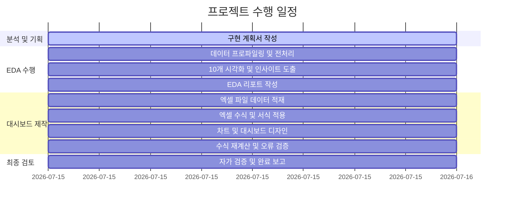

# YES24 도서 데이터 EDA 및 엑셀 대시보드 구축 구현 계획서

이 문서는 `yes24/data/yes24_books.csv` 데이터를 활용하여 탐색적 데이터 분석(EDA)을 수행하고, 이를 바탕으로 시각적으로 수려하며 동적인 엑셀 대시보드(`.xlsx`)를 구축하기 위한 상세 계획서입니다.

---

## 1. 프로젝트 개요 및 분석 목표
* **데이터셋**: YES24 도서 목록 데이터 (1,200행, 11개 컬럼)
* **목표**: 
  1. 도서 가격, 리뷰 수, 판매지수 등의 분포 및 상관관계를 분석하여 핵심 인사이트 도출 (최소 10개 시각화 그래프 작성)
  2. 도서 데이터의 패턴(출판일 추이, 주요 출판사, 키워드 트렌드 등) 파악
  3. 실무 비즈니스 의사결정에 즉시 활용 가능한 전문가 수준의 **Excel 대시보드** 구축 (하드코딩 배제, 수식 및 서식 적용)
* **작성 규칙**: 
  - 모든 설명, 코드 주석, 리포트는 **한국어**로 작성
  - 모든 임시 및 산출 아티팩트는 워크스페이스 내 `yes24/docs/` 폴더에 생성 및 유지

---

## 2. 데이터 분석(EDA) 상세 계획
`py-eda` 스킬 지침에 의거하여 다음과 같이 데이터 분석을 체계적으로 진행합니다.

### A. 데이터 탐색 및 프로파일링
* 상하위 행(각 5개), 기본 정보(`info()`), 데이터 크기(`shape`), 중복 행 수(`duplicated().sum()`), 전체 기술통계량(`describe(include='all')`) 산출 및 리포트 기록.

### B. 시각화 계획 (최소 10개 그래프 작성)
1. **정가 및 판매가 분포 (Histogram/KDE)** - 도서 가격의 분포 확인 (일변량)
2. **할인율 분포 (Histogram)** - 정가 대비 판매가의 할인율 분포 분석 (일변량)
3. **판매지수 분포 (Boxplot/Violinplot)** - 판매지수의 퍼짐 정도와 이상치 분석 (일변량)
4. **리뷰 수 분포 (Boxplot/Violinplot)** - 리뷰 수의 분포 및 편향성 분석 (일변량)
5. **발행일 연도별/월별 추이 (Line/Bar Chart)** - 연도 및 월별 도서 출판 트렌드 (이변량)
6. **판매가 vs 판매지수 상관관계 (Scatter Plot)** - 가격에 따른 판매지수 변화 분석 (이변량)
7. **판매지수 vs 리뷰 수 상관관계 (Scatter Plot)** - 인기도 지표 간의 상관관계 확인 (이변량)
8. **주요 출판사 상위 30개 점유율 (Horizontal Bar Chart)** - 최다 도서 출판사 분포 (범주형)
9. **주요 저자 상위 30개 점유율 (Horizontal Bar Chart)** - 최다 저작 저자 분포 (범주형)
10. **도서 설명/제목 텍스트 키워드 분석 (TF-IDF 상위 30개 Bar Chart)** - 주요 핵심 키워드 도출 (텍스트 분석)

* **시각화 준수 사항**:
  - `seaborn` 스타일 미사용 (matplotlib 기본 스타일 + 깔끔한 커스텀 테마 적용)
  - `koreanize-matplotlib`를 사용하여 한글 폰트 깨짐 방지
  - 시각화 이미지들을 `yes24/images/` 폴더에 저장
  - 각 시각화 결과물 아래에 수치 요약 **표(Table)** 제공
  - 각 그래프마다 **50자 이상의 상세한 분석 해석문 및 인사이트** 제공

---

## 3. 엑셀 대시보드(`.xlsx`) 구축 계획
`xlsx` 스킬 지침에 의거하여 기획 및 디자인을 진행합니다.

### A. 워크북 구조 설계
대시보드 파일(`yes24_dashboard.xlsx`)은 다음 시트들로 구성합니다.

1. **Dashboard (대시보드)**
   - 핵심 KPI 요약 카드 (총 도서 수, 평균 정가/판매가, 평균 할인율, 총 판매지수 합계, 평균 리뷰 수 등)
   - 주요 통계 테이블 (출판사별 Top 10, 연도별 트렌드 등)
   - 엑셀 차트 삽입 (출판사별 도서 수 및 판매지수 등 시각화 요소 배치)
2. **Analysis_Data (분석 요약 데이터)**
   - 대시보드의 테이블과 차트가 참조할 피벗 형태의 원천 요약 테이블 (수식으로 연동)
3. **Raw_Data (원본 데이터)**
   - `yes24_books.csv` 로우 데이터를 그대로 로드하여 저장한 백업 시트
4. **상위 7개 출판사별 개별 시트**
   - 대상 출판사: 커뮤니케이션북스, 한빛미디어, 길벗, 제이펍, 골든래빗, 앤써북, 위키북스
   - 해당 출판사들의 도서 목록만 분리하여 개별 시트로 적재하고, 테이블 마지막 행에 `AVERAGE` 및 `SUM` 수식을 활용한 통계적 요약 행을 추가
5. **기타_출판사 (통합 시트)**
   - 상위 7개 출판사를 제외한 나머지 모든 출판사의 도서 목록을 하나의 시트로 통합 기입하고, 동일하게 하단 요약 행 적용

### B. 디자인 및 서식 규칙
* **폰트**: `맑은 고딕(Malgun Gothic)`으로 일관되게 적용
* **색상 팔레트**:
  - 주조색 (Primary): 네이비 (RGB: 27, 54, 93) - 헤더 배경
  - 보조색 (Secondary): 스틸 블루 (RGB: 70, 130, 180) - 서브 헤더/강조
  - 폰트 색상 표준:
    - **검은색 (Black)**: 모든 수식 및 계산 결과
    - **파란색 (Blue)**: 수동 입력 혹은 하드코딩 데이터
    - **녹색 (Green)**: 시트 간 연동 수식
    - **노란색 배경 (Yellow)**: 핵심 가정 및 참고가 필요한 셀
* **숫자 포맷팅**:
  - 가격: `₩#,##0` 또는 `#,##0` (원화 표시 형식)
  - 할인율, 비율: `0.0%`
  - 판매지수/리뷰 수: `#,##0` (천 단위 구분 기호)
  - 0인 값: `"- "` (하이픈으로 표시)
  - 음수 값: `(1,234)` (괄호로 표시)

### C. 수식 적용 계획 (하드코딩 금지)
* KPI 요약 카드: `COUNT`, `AVERAGE`, `SUM`, `MAX`, `MIN` 등의 수식 사용
* 조건부 합계 및 통계: `AVERAGEIF`, `SUMIF`, `COUNTIF`, `VLOOKUP`, `INDEX/MATCH` 등을 적극 활용하여 실시간 연동
* 엑셀 파일 저장 후 `python .agents/skills/xlsx/scripts/recalc.py`를 실행하여 포뮬러 에러 검증 및 recalculation 강제화

---

## 4. 수행 일정 및 절차

---

## 5. 자가 검증(Self-Verification) 체크리스트
분석이 완료된 후 다음 체크리스트를 확인하고 결과를 검증 리포트로 제공합니다.
* [ ] 데이터 탐색 필수 5단계(상하위 행, info, 크기, 중복, 기술통계)를 성실히 보고서에 반영했는가?
* [ ] 시각화 그래프가 10개 이상 작성되었고 `seaborn` 스타일 설정을 사용하지 않았는가?
* [ ] `koreanize-matplotlib`를 적용해 시각화 한글 깨짐이 없는가?
* [ ] 생성된 그래프 이미지들이 `yes24/images/` 폴더에 별도로 저장되었는가?
* [ ] 각 그래프 하단에 수치 요약 표(Table)가 제공되는가?
* [ ] 각 그래프마다 50자 이상의 상세한 설명과 해석이 덧붙여졌는가?
* [ ] 엑셀 파일에 수식 오류(#REF!, #DIV/0! 등)가 존재하지 않는가?
* [ ] 계산 과정에서 파이썬 계산 하드코딩을 배제하고 엑셀 수식을 활용했는가?
* [ ] 대시보드가 가독성 높고 세련된 디자인(맑은 고딕, 표준 색상, 숫자 포맷팅)을 따르고 있는가?
* [ ] 모든 산출물이 한국어로만 작성되었는가?
* [ ] 아티팩트 복사본이 `yes24/docs/` 폴더에 올바르게 저장되었는가?
